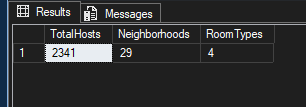
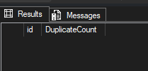
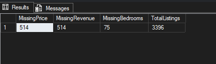
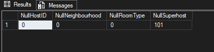
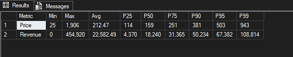

# Victoria Airbnb Market Analysis | SQL


---

## Project Overview

This project analyzes the Airbnb market in **Victoria, British Columbia** using **SQL Server** to transform raw Airbnb listing data into business-ready insights.

The project covers **data validation**, **data quality assessment**, **data cleaning**, **exploratory analysis**, and **business reporting** to understand neighborhood performance, host behavior, licensing compliance, occupancy trends, and market concentration.

The cleaned analytical view (`vw_airbnb_clean`) created in this project serves as the data source for the companion **Power BI Dashboard**.

---

## Highlights

- 🏠 **3,396** Airbnb listings analyzed
- 👥 **2,341** Hosts
- 🗺️ **29** Neighborhoods
- 🛏️ **4** Room Types
- 📊 **5** Business Questions
- 🧹 End-to-end SQL data validation, cleaning, profiling & business analysis
- 📈 Powers an interactive Power BI dashboard

---

## Data Pipeline

```text
Inside Airbnb Dataset

↓

Data Validation

↓

Data Quality Assessment

↓

Data Cleaning & Profiling

↓

Analytical View (vw_airbnb_clean)

↓

Business Analysis (BQ1–BQ5)

↓

Power BI Dashboard
```

---

## Dataset

| Attribute | Value |
|-----------|-------|
| **Source** | Inside Airbnb |
| **City** | Victoria, British Columbia, Canada |
| **Snapshot** | September 2025 |
| **Dataset** | listings.csv.gz |
| **Granularity** | One row per Airbnb listing |

---

## SQL Skills Demonstrated

### SQL Server

- Data Validation
- Data Cleaning
- Data Profiling
- Exploratory Data Analysis (EDA)
- View Creation
- Business Analysis

### SQL Concepts

- Common Table Expressions (CTEs)
- CASE Expressions
- Aggregate Functions
- Window Functions
- `PERCENTILE_CONT()`
- `GROUP BY`
- `HAVING`
- `ORDER BY`
- Data Formatting
- Analytical Views

---

# Data Validation & Preparation

Before performing business analysis, the dataset was validated, profiled, and cleaned to ensure analytical reliability and data quality.

---

### Dataset Validation



**Highlights**

- **2,341 Hosts**
- **29 Neighborhoods**
- **4 Room Types**

---

### Duplicate Check



**Result**

✅ No duplicate listing IDs were found, confirming record uniqueness.

---

### Missing Value Assessment



**Findings**

- **3,396** Total Listings
- **514** Missing Price values
- **514** Missing Revenue values
- **75** Missing Bedroom values

Price and Revenue were missing together for the same listings, making those records unsuitable for revenue analysis.

---

### Data Quality Checks



**Findings**

- ✅ No missing Host IDs
- ✅ No missing Neighborhoods
- ✅ No missing Room Types
- **101** missing Superhost values

---

### Distribution & Outlier Analysis




**Findings**

- Price and revenue distributions are heavily right-skewed.
- Percentile analysis confirmed that extreme values represent genuine luxury listings rather than data quality issues.
- Outliers were retained to accurately represent the Victoria Airbnb market.

---

# Business Questions

---

## BQ1. Which neighborhoods generate the highest Airbnb revenue?


### Key Findings

- **Metchosin** recorded the highest average annual revenue per listing (**$33.4K**) despite having only **33 listings**.
- **Central Saanich** ranked second with an average revenue of **$31.9K**.
- **Juan de Fuca** combined high listing volume (**350 listings**) with strong average revenue (**$30.1K**), making it one of the strongest-performing neighborhoods overall.

---

## BQ2. Do Superhosts outperform regular hosts?


### Key Findings

- Superhosts generate **nearly 89% higher average annual revenue** than Regular Hosts.
- Average occupancy for Superhosts (**152 days**) is almost double that of Regular Hosts (**78 days**).
- Higher occupancy—not higher nightly pricing—is the primary driver of increased revenue.

---

## BQ3. Which room types generate the strongest performance?


### Key Findings

- **Entire homes/apartments** dominate the market with **2,528 listings** and generate an average annual revenue of **$23.8K**.
- **Private rooms** earn substantially lower revenue despite maintaining comparable occupancy.
- Hotel and Shared Room categories contain too few listings to represent broader market trends.

---

## BQ4. How does licensing impact market performance?


### Key Findings

- **Registered listings** account for **70.8%** of all listings and generate **79.7%** of total market revenue.
- Listings without license information still contribute approximately **$7.9M** annually (**12.2%** of market revenue).
- Registered listings achieve the highest average revenue and occupancy among all licensing categories.

---

## BQ5. How concentrated is the Airbnb market across host categories?


### Key Findings

- **Individual Hosts** account for **57.9%** of listings while generating **63%** of total market revenue.
- Only **20 Commercial Operators** manage **371 listings**, highlighting significant market concentration among a small number of hosts.
- Average revenue per listing decreases as portfolio size increases, suggesting larger operators prioritize scale over revenue generated per listing.

---

## Repository Structure

```text
Airbnb-Victoria-SQL

│── README.md
├── Data
│   ├── listings_detailed_victoria_sql.csv

├── Data_Preparation
│   ├── 01_Data_Preparation.sql
│   └── screenshots

├── Business_Analysis
│   ├── 02_Victoria_Airbnb_Business_Analysis.sql
│   └── screenshots
```

---

## Related Project

### Victoria Airbnb Market Analysis | Power BI

The analytical SQL view (`vw_airbnb_clean`) created in this project serves as the foundation for an interactive Power BI dashboard featuring:

- Executive KPIs
- Drill-through analysis
- Dynamic DAX measures
- Geospatial analysis
- Revenue concentration analysis
- Commercial operator insights

➡️ **Power BI Repository**

https://github.com/nive710/Victoria-Airbnb-Market-Analysis-PowerBI
